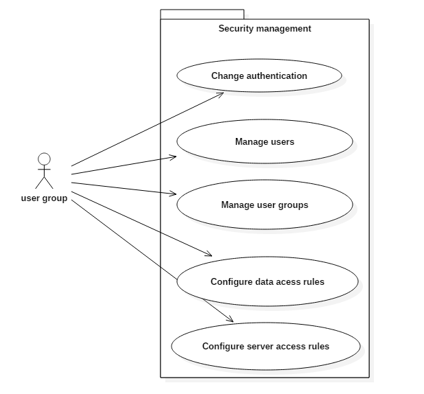
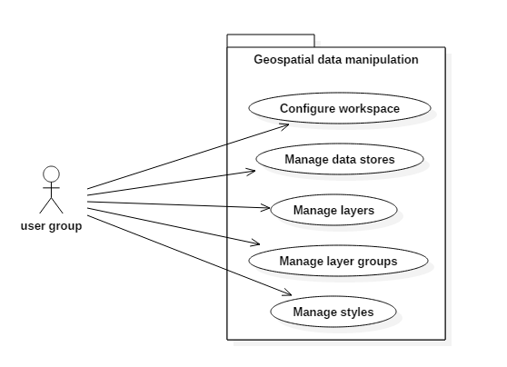

## High Level Requirement Specification for GeoServer

### Table of Contents
1. [Introduction]("#intro")
2. [Overall Description]("#description")
3. [External Interface Requirements]("#external")
4. [System features or use cases]("#sysfeatures")
5. [Other Nonfunctional Requirements]("#othernonfunc")
6. [Other Requirements]("#others")

###  1. Introduction

#### 1.1 Context

GeoServer is an open source java server that allows users to share, process and edit geospatial data. One of the more important aspects of the server is the integration with various geographic information systems in use today, which is done through open standards.

#### 1.2 Purpose and Scope

This document intends to represent a high level view of GeoServer, through its features, interfaces and some non-functional requirements considered essential.

### 2. Overall Description

This section presents an overview of the functionalities of GeoServer from various user's perspectives, _TODO:_ and is intended for end users and developers.

Admin:
web interface
.authenticate
->data
 .preview layers
 .edit workspaces
 .edit layers/layers groups
 .edit styles
->services (__core__)
 .wcs
 .wfs
 .wms
->settings:low level(ll)
 .ll:global
 .ll:jai (Administer settings related to Java Advanced Imaging)
 .ll:coverage access
->tile caching
 .ll:tyle layers:Manage the cached layers published by the integrated GeoWebCache
 .ll:caching:Configure the global settings for the embedded GeoWebCache
 .ll:edit gridset:Manage the available gridsets or create a new one
 .vll:disk quota
 .vll:blobstores
->security
 .ll:settings
 .ll:authentication
 .vll:pass settings
 .manage users/groups/roles
 .manage data security
 .services:Manage service level security: edit, add and remove access rules

1. Acesso e manipulação de dados geográficos via Web;
2. Utilizar o geoserver e os seus layers em serviços da google (google maps)
3. Criação de novos layers (e editar e/ou combinar layers existentes) e publicação dos mesmos
4. Diferentes utilizadores para maior segurança (admin, user, etc...)
5. Possibilidade de criar workspaces para partilha de informação
6. Ferramentas poderosas para analises estatisticas
7. Habilidade para fazer overlays rápidos mesmo com datasets complexos
8. Diferentes formatos de informação:
- shape files
- PostGis
- Porperties
- WFS – possibilidade de acessar e publicar caracteristas de outros servidores
9. Possibilidade de criar, questionar, atualizar e administrar a base de dados (DBMS)
10. Diferentes formatos de output de web map service
11. Possibilidade de gerir diferentes formatos binários e misturá-los num mapa
12. Possibilidade de adicionar extensões como por exemplo Oracle e MySQL
13. Possibilidade de utilizar o geoserver em sites
13. Albergar vários utilizadores online ao mesmo tempo graças ao caching
14. Segurança de informação através de criptografia de forma simples ou complexa, se quisermos simplesmente publicar a informação ou trabalhar numa coorporação grande

.alto nivel (basear em casos de uso; não entrar em 'detalhes')
.not análise de como geoserver devs levantam req!
.distinguir utilizadores dos mapas criados ou editados dos 'editores'
.ler requisitos de outros sistemas
.ver se outra pessoa ao ler reqs podia chegar a software semelhante
what/how- tirar funcionalidade básica, passar aos módulos
requisitos futuros:
.gsip; jira

passados:
.tirar casos de uso do manual
>data dir(ll)
>web admin:
 .lidar c/ user groups
> working w/ raster e vector data
 .data handling (img)
> databse connections

exemplo prioritização:
https://osgeo-org.atlassian.net/projects/GEOS/issues/GEOS-7235?filter=allopenissues

geoserver allows handling geo spatial data from multiple sources
creates a server (w/ multiple users+admin) to handle manip and viewing of data
integration with providers (protocls implementation)
integ with external databses
interface reqs
layer handling(ll)
-check qGis use cases
-ver livros (principalmente n.º 1)
