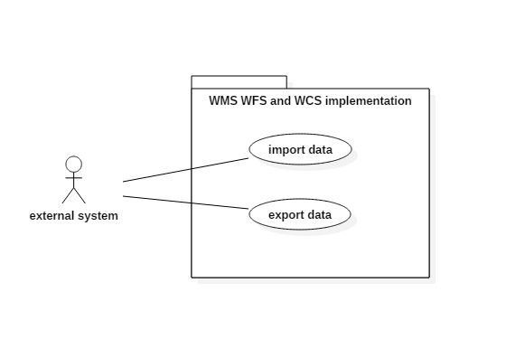

## High Level Requirement Specification for GeoServer

### Table of Contents
1. [Introduction](#intro)
  1. [Context](#context)
  2. [Purpose and Scope](#purpose)
2. [Overall Description and Use Cases](#description)    
4. [Non-functional Requirements](#nonfunc)
 1. [WFS, WCS and WMS](#services)
 2. [Formats and Protocols](#formats)
 3. [Perfomance](#performance)
 4. [Security: Authentication Providers](#pass)
 5. [Layer security](#layer)
 6. [Service Security](#service)
 7. [Google Earth](#google)
 

###  1. Introduction

####  1.1 Context

GeoServer is an open source java server that allows users to share, process and edit geospatial data. One of the more important aspects of the server is the integration with various geographic information systems in use today, which is done through open standards.

####  1.2 Purpose and Scope

This document intends to represent a high level view of GeoServer, through its features, interfaces and some non-functional requirements considered essential.

####

###  2. Overall Description and Use Cases

This section presents an overview of the functionalities of GeoServer from various user's perspectives, and is intended for end users and developers.

_Services to be provided for integration with other systems_

_Security management of the server_

_Data management for the server_

###  3. Non-functional Requirements

####  3.1 WFS, WCS and WMS

To allow sharing of data GeoServer implements the following widely used open standards for geospatial data:

*  [WFS](http://www.opengeospatial.org/standards/wfs) versions 1.0.0, 1.1.0 and 2.0.0 for vector data. This allows compliant systems acess to the data structures and source data.
  * The WFS implementation is integrated with the Security system to limit access.

* [WCS](http://www.opengeospatial.org/standards/wcs) versions 1.0, 1.1 and 2.0. They work similarly to WFS but for raster data.

* [WMS](http://www.opengeospatial.org/standards/wms) versions 1.1.1, the most used, and 1.3.0. WMS provides a standard for geospatial map image requests, allowing clients to combine multiple images.
 * GeoServer also provides KML as a WMS output, allowing integration with for example, google earth.

####  3.2 Formats and Protocols
- Vector files, Shape files, a popular geospatial vector data format for geographic information system (GIS) software 
- Servers, DBMS, allows users to place the index for the granules into a spatial DBMS as explained below. This is especially important when one or more of the following conditions apply:
•	The granules depicts a phenomenon that depends on multiple dimensions (e.g. Time, Elevation and so on)
•	The granules will be added/remove/update frequently at runtime, hence a full-blown transactional DMBS would be a better choice for the index.
-	Styled maps, allow you to customize the presentation of the standard Google base maps, changing the visual display of such elements as roads, parks, and built-up areas.
-	Raster files, is a dot matrix data structure representing a generally rectangular grid of pixels, or points of color, viewable via a monitor, paper, or other display medium.

####  3.3 Performance

Geoserver has a geowebcache:
* it's a Java web application used to cache map tiles coming from a variety of sources such as OGC Web Map Service (WMS). It implements various service interfaces (such as WMS-C, WMTS, TMS, Google Maps KML, Virtual Earth) in order to accelerate and optimize map image delivery. It can also recombine tiles to work with regular WMS clients. 

####  3.4 Security: Authentication providers
The following authentication providers are available in GeoServer:
*	Authentication of a username/password against a user/group service
*	Authentication against an LDAP server
*	Authentication by connecting to a database through JDBC

#### Username/password authentication
Username and password authentication is the default authentication provider. It uses a user/group service to authenticate.
The provider simply takes the username/password from an incoming request (such as a Basic Authentication request), then loads the user information from the user/group service and verifies the credentials

#### LDAP authentication

The LDAP authentication provider allows for authentication against a Lightweight Directory Access Protocol (LDAP) server. The provider takes the username/password from the incoming request and attempts to connect to the LDAP server with those credentials.
* Note:
Currently only LDAP Bind authentication is supported.

####  3.5 Security: Layer security
GeoServer allows access to be determined on a per-layer basis.

####  3.6 Security: Service Security
GeoServer supports access control at the service level, allowing for the locking down of service operations to only authenticated users who have been granted a particular role. There are two main categories of services in GeoServer. The first is OWS services such as WMS and WFS. The second are RESTful services, such as the GeoServer REST configuration.

####  3.7 Security: Google Earth
GeoServer is useful when one wants to put a lot of data on to Google Earth. GeoServer automatically generates KML that can be easily and quickly served and visualized in Google Earth. GeoServer operates entirely through a Network Link, which allows it to selectively return information for the area being viewed. With GeoServer as a robust and powerful server and Google Earth providing rich visualizations, they are a perfect match for sharing your data.

