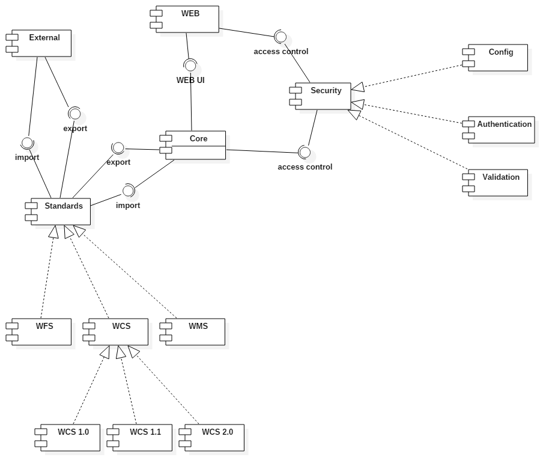

Viewpoints

### Geoserver core

### Security implementation

#### Security core classes

#### Security authentication classes

#### Security configuration classes

#### Security validation classes

### Standards implementation

#### WCS

##### WCS 1.0

##### WCS 1.1

##### WCS 2.0

#### WFS

#### WMS

### Web UI implementation

