## Architectural Design for GeoServer

### Table of Contents
1. [Introduction](#intro)
2. [Views](#views)    
  1. [Implementation view](#implementation)
  2. [Logical view](#logical)
    1. [Geoserver core](#geo_core)
    2. [Security implementation](#security)
        1. [Security core classes](#sec_core)
        2. [Security authentication classes](#sec_auth)
        3. [Security configuration classes](#sec_config)
        4. [Security validation classes](#sec_valid)
    3. [Standard implementation](#standard)
        1. [WCS](#wcs)
            2. [WCS 1.0](#wcs_1_0)
            3. [WCS 1.1](#wcs_1_1)
            4. [WCS 2.0](#wcs_2_0)
        2. [WFS](#wfs)
        3. [WMS](#wms)
    4. [Web UI implementation](#web)
  3. [Process view](#process)
  4. [Deployment view](#deployment)

##  1. Introduction

This document intends to describe the software structure of geoserver, derived from the project's source code and documentation.
To represent the projects architecture we will be using the [__4+1__ architectural view model](https://en.wikipedia.org/wiki/4%2B1_architectural_view_model). This model consists of 4 concurrent and a set of use cases (the + 1) which can be found on [Report 2](Report 2.md).

##  2. Views

##  2.1 Implementation view
The following component diagram represents a high level view of the main components of geoserver, as it is implemented.

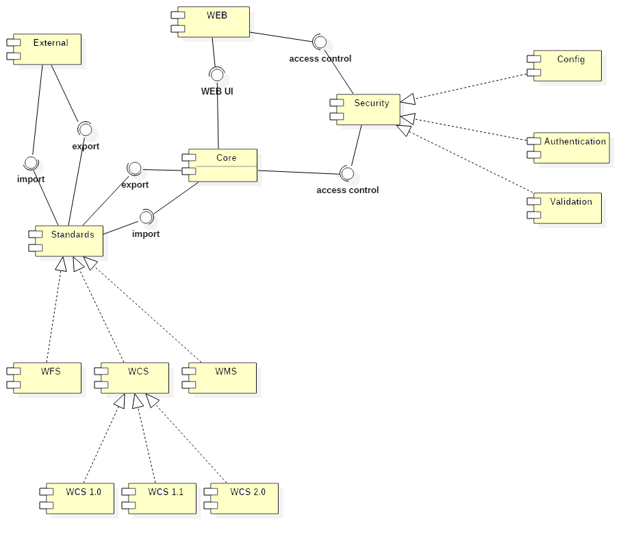

##  2.2 Logical view
These are the classes that correspond to the overarching components represented on the previous component diagram.

### High level class packages representation
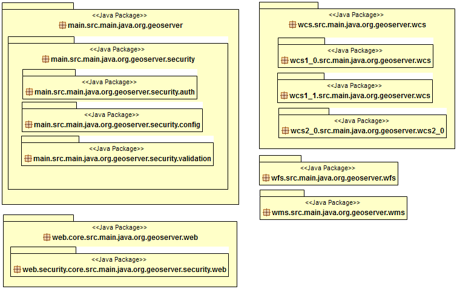

###  2.2.1 Geoserver core
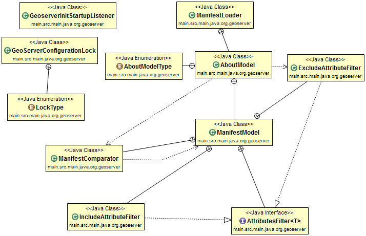

###  2.2.2. Security implementation

####  Security core classes
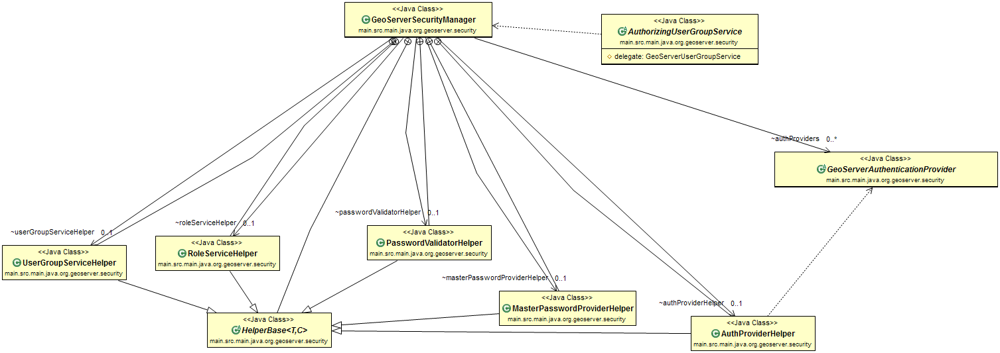
####  Security authentication classes
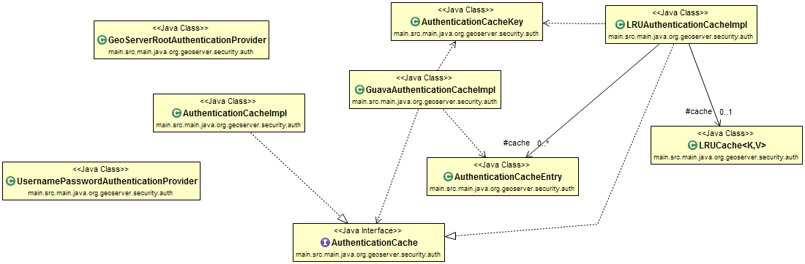
####  Security configuration classes
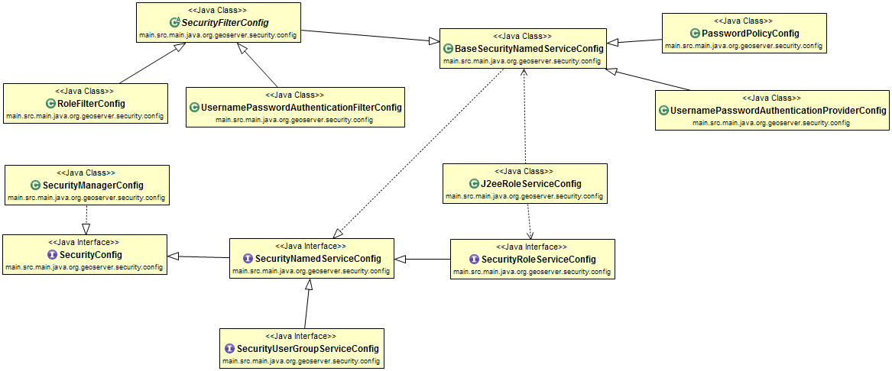
####  Security validation classes
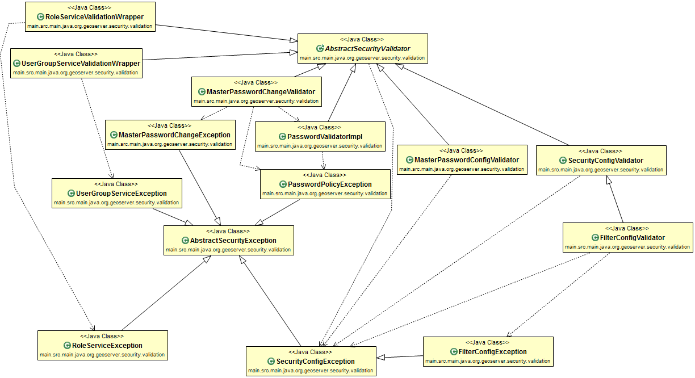

###  2.2.3. Standards implementation

####  WCS
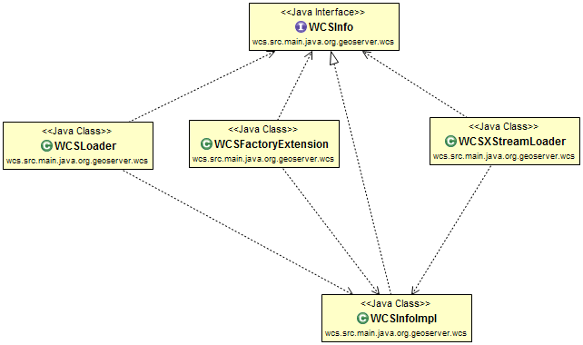
#####  WCS 1.0
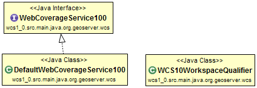
#####  WCS 1.1
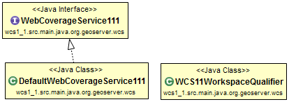
#####  WCS 2.0
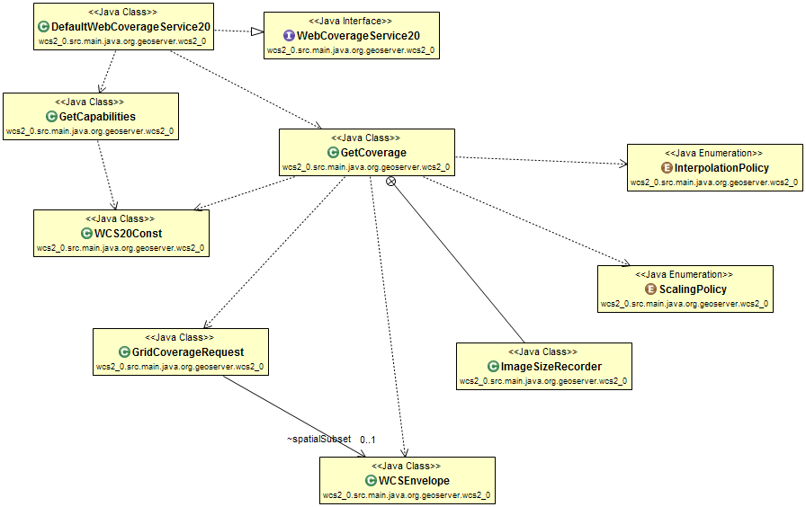

####  WFS
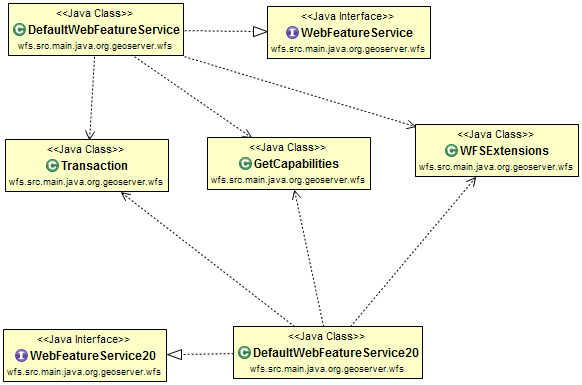

####  WMS
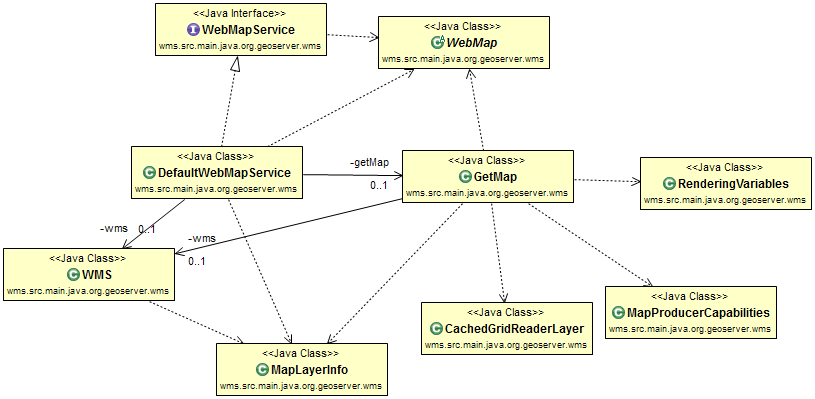

###  2.2.4. Web UI implementation
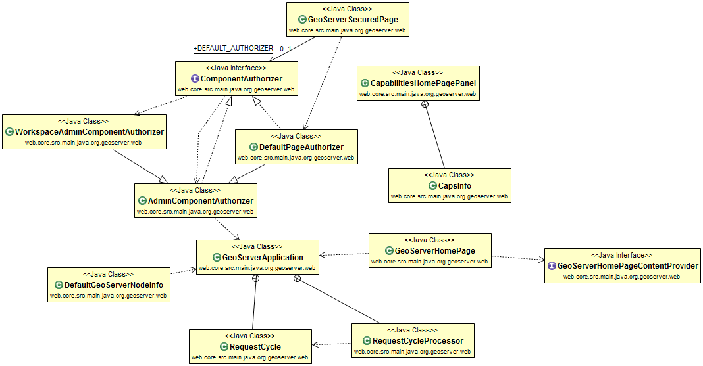

##  2.3. Process view
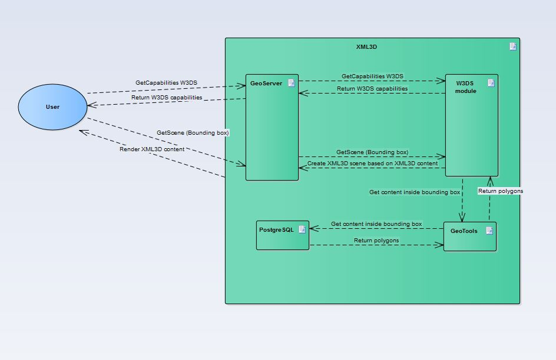

##  2.4. Deployment view
